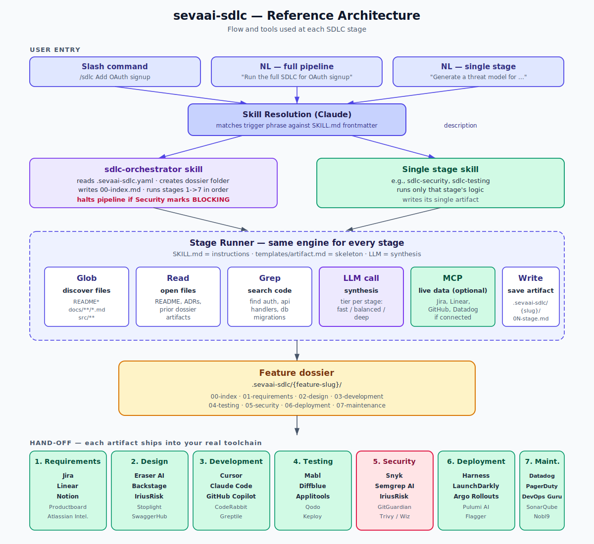

# sevaai-sdlc — Reference Architecture



## The flow in one paragraph

A user types a trigger phrase in their Claude Code or Cowork session. Claude matches that phrase against every installed `SKILL.md`'s `description` field and routes to either the **orchestrator skill** (full pipeline) or a **single stage skill** (one artifact). Whichever skill runs, it executes the same engine: `Glob` to discover relevant project files, `Read` to open them, `Grep` to search code, an `LLM call` to synthesize the artifact, an optional `MCP` call for live data from connected systems (Jira, Datadog, etc.), and `Write` to save the artifact under `docs/sdlc/{feature-slug}/`. Each stage's artifact is meant to be the structured input a real downstream product (Snyk, Mabl, LaunchDarkly, PagerDuty, ...) can consume.

## Layers

### 1. User entry (top of diagram)

Three triggers, all valid:

- **Slash command**: `/sdlc <feature description>` — most explicit; runs the orchestrator.
- **Natural language, full pipeline**: "run the full SDLC for X", "from idea to runbook for X", etc. — orchestrator triggers via description match.
- **Natural language, single stage**: "generate a threat model for X", "write a test plan for X", etc. — only the matching stage skill runs.

### 2. Skill resolution

This step happens inside Claude itself, not in the toolkit. Claude reads the `description:` frontmatter of every installed skill and picks the best match for the trigger phrase. The richer and more specific your `description`, the more reliably your skill triggers — that's why every `SKILL.md` in this pack lists 5-15 explicit trigger phrases in its description.

### 3. Routing

- If the orchestrator wins, it loads `.sevaai-sdlc.yaml` (if present), creates the dossier folder, writes `00-index.md`, then iterates stages 1 -> 7. Between stages it can pause, summarize, and ask the user before continuing — especially after the security stage if it's marked `BLOCKING`.
- If a single stage wins, it runs in isolation and writes its single artifact.

### 4. Stage runner — the engine

This is the core of the toolkit. The same six-step machinery runs at every stage:

| Tool | Purpose | Where it's used |
|---|---|---|
| **Glob** | discover files matching a pattern | every stage |
| **Read** | open specific files | every stage |
| **Grep** | search file contents | mostly Design / Development / Security |
| **LLM call** | synthesize the artifact from context + template | every stage; tier (`fast` / `balanced` / `deep`) per stage |
| **MCP** (optional) | call connected services for live data | only if the user has Jira / Linear / GitHub / Datadog / etc. MCP servers connected |
| **Write** | save the artifact | every stage, last step |

The only thing that changes between stages is **which files Glob/Read/Grep target**, **what the LLM is told to produce**, and **which artifact template gets filled in**. The `SKILL.md` is the configuration; the LLM is the engine; the template is the shape.

### 5. Output dossier

Every run produces (or appends to) a folder at `docs/sdlc/{feature-slug}/`:

```
00-index.md          # index that lists all 7 artifacts and stage status
01-requirements.md   # user stories + acceptance criteria
02-design.md         # components + API + data model + ADR
03-development.md    # PR breakdown + file plan + Cursor/Copilot prompt
04-testing.md        # pyramid + edge cases + unit-test stubs
05-security.md       # STRIDE + OWASP + compliance + pen test plan
06-deployment.md     # rollout + flags + canary + rollback runbook
07-maintenance.md    # SLOs + runbook + on-call cheat sheet + tech debt
```

### 6. Hand-off — what each artifact ships into

The toolkit's job ends when the artifact is written. The artifact is meant to flow into the real product the team already uses for that stage. The seven columns at the bottom of the diagram show the most common destinations.

This is the most important design choice in the toolkit: **we don't reinvent Jira / Snyk / Datadog — we produce structured input that flows into them.** That's why the toolkit can be a markdown skill pack instead of a hosted service.

## Configuration surface

The toolkit reads `.sevaai-sdlc.yaml` at the project root. Two things can be tuned there:

1. **Project context** — stack, compliance frameworks, observability tools, default conventions. This gets injected into every stage's system prompt so the artifacts match your reality.
2. **Per-stage overrides** — pick a different model tier (fast / balanced / deep) per stage; override the default model name.

Everything else lives in the per-stage `SKILL.md` and its `templates/artifact.md`. Edit those to encode team-specific norms (your ADR location, your test framework, your compliance gates).

## Why this architecture

- **No runtime to host.** It's all markdown + a JSON manifest. Distribute via a Git repo.
- **Composable.** Skills are independent; the orchestrator is just a thin coordinator.
- **Tool-agnostic.** Skills mention real products by name but don't depend on any of them — fail gracefully when they're not connected.
- **Editable by the team.** Change a `SKILL.md` to encode your conventions. No rebuild, no redeploy.
- **Compatible with single LLM.** The full pipeline runs on whatever model your Claude Code / Cowork session is using; tier hints in the config let smart hosts route differently if they choose.
