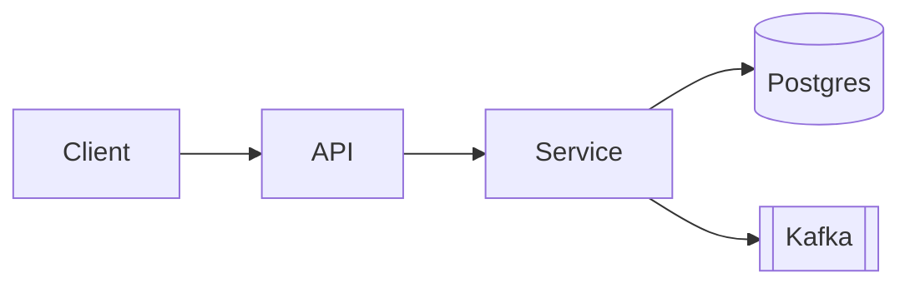
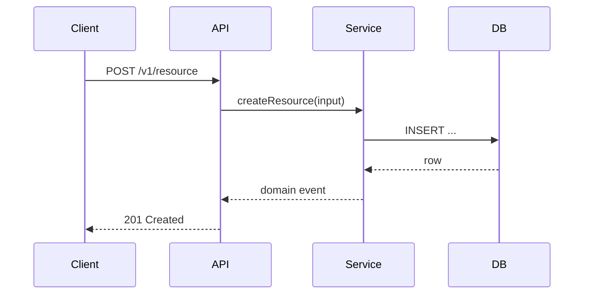

# Design — {Feature Name}

**Feature slug:** `{feature-slug}`
**Status:** Draft
**Date:** {YYYY-MM-DD}
**Supersedes:** None | ADR-NNNN

## 1. Context

What problem this design solves. Quote the requirements.

## 2. High-Level Design (HLD)

### 2.1 Component diagram



### 2.2 Service responsibilities

| Service | Responsibility | Owns |
|---|---|---|
| API | request validation, auth, response shaping | HTTP boundary |
| Service | domain logic | core invariants |
| DB | durable state | tenant data |

### 2.3 Tech stack decisions

Stack choices and why each was selected over alternatives. Reference any ADRs.

### 2.4 Integration points

External systems this design touches (REST / event / direct DB).

## 3. Low-Level Design (LLD)

### 3.1 Module / package structure

```
src/services/{name}/
├── service.ts
├── types.ts
├── repository.ts
└── handlers/
    └── http.ts
```

### 3.2 API contracts

#### `POST /v1/{resource}`

```yaml
summary: Create a {resource}
auth: bearer
request:
  schema:
    type: object
    required: [field_a]
    properties:
      field_a: { type: string }
responses:
  201: { description: created, schema: { $ref: '#/Resource' } }
  400: { description: validation error }
  401: { description: unauthorized }
```

### 3.3 Data model

```sql
CREATE TABLE example (
  id          UUID PRIMARY KEY DEFAULT gen_random_uuid(),
  field_a     TEXT NOT NULL,
  created_at  TIMESTAMPTZ NOT NULL DEFAULT now()
);
CREATE INDEX example_field_a_idx ON example (field_a);
```

Include migration plan (forward + rollback).

### 3.4 Sequence diagrams



### 3.5 Configuration / environment variables

| Variable | Purpose | Default |
|---|---|---|
| `{NAME}` | what it controls | none |

## 4. ADR — {Title}

- **Status**: Proposed
- **Decision**: ...
- **Alternatives considered**:
  1. {Alt A} — rejected because {reason}
  2. {Alt B} — rejected because {reason}
- **Consequences**: positive / negative / neutral

## 5. First-pass threat model (STRIDE)

| Component | Spoofing | Tampering | Repudiation | Info disclosure | DoS | Elevation |
|---|---|---|---|---|---|---|
| API | | | | | | |
| Service | | | | | | |
| DB | | | | | | |

The full review happens in stage 5 (`sdlc-security`).

## 6. Open questions

- ...

## 7. Hand-off

Next stage: **Development** (`sdlc-development`). Artifact: `03-development.md`.
