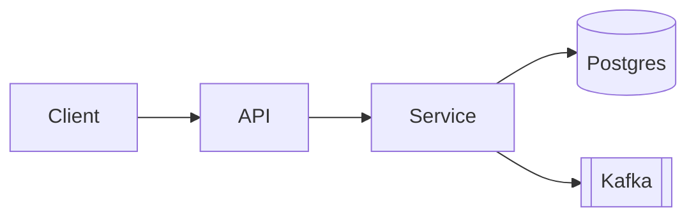

# Design — {Feature Name}

**Feature slug:** `{feature-slug}`
**Status:** Draft
**Date:** {YYYY-MM-DD}
**Supersedes:** None | ADR-NNNN

## 1. Context

What problem this design solves. Quote the requirements.

## 2. Component diagram



## 3. API contracts

### `POST /v1/{resource}`

```yaml
summary: Create a {resource}
auth: bearer
request:
  schema:
    type: object
    required: [field_a]
    properties:
      field_a: { type: string }
responses:
  201: { description: created, schema: { $ref: '#/Resource' } }
  400: { description: validation error }
  401: { description: unauthorized }
```

## 4. Data model

```sql
CREATE TABLE example (
  id          UUID PRIMARY KEY DEFAULT gen_random_uuid(),
  field_a     TEXT NOT NULL,
  created_at  TIMESTAMPTZ NOT NULL DEFAULT now()
);
CREATE INDEX example_field_a_idx ON example (field_a);
```

Include migration plan (forward + rollback).

## 5. ADR — {Title}

- **Status**: Proposed
- **Decision**: ...
- **Alternatives considered**:
  1. {Alt A} — rejected because {reason}
  2. {Alt B} — rejected because {reason}
- **Consequences**: positive / negative / neutral

## 6. First-pass threat model (STRIDE)

| Component | Spoofing | Tampering | Repudiation | Info disclosure | DoS | Elevation |
|---|---|---|---|---|---|---|
| API | | | | | | |
| Service | | | | | | |
| DB | | | | | | |

The full review happens in stage 5 (`sdlc-security`).

## 7. Open questions

- ...

## 8. Hand-off

Next stage: **Development** (`sdlc-development`). Artifact: `03-development.md`.
