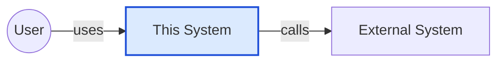
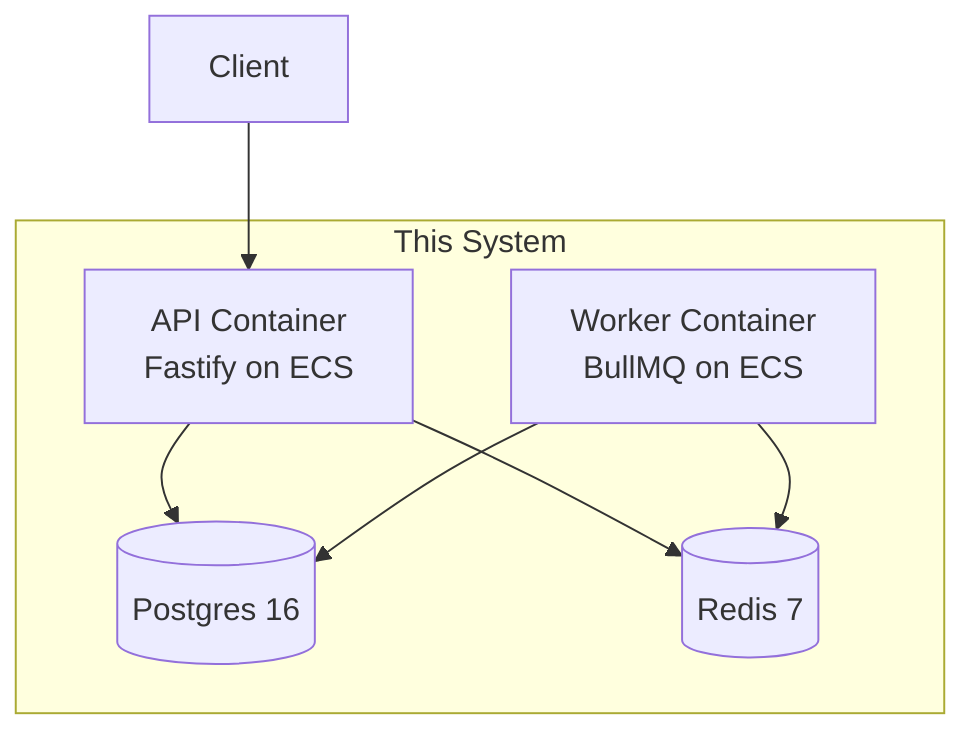
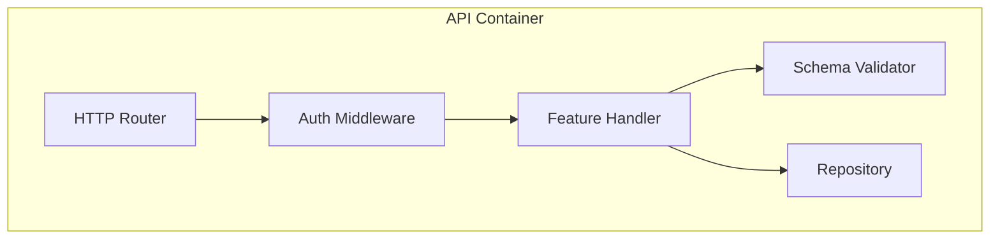
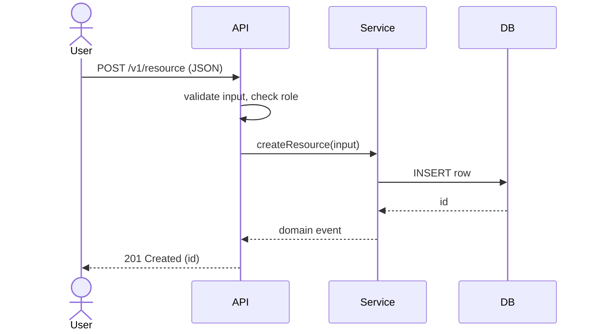
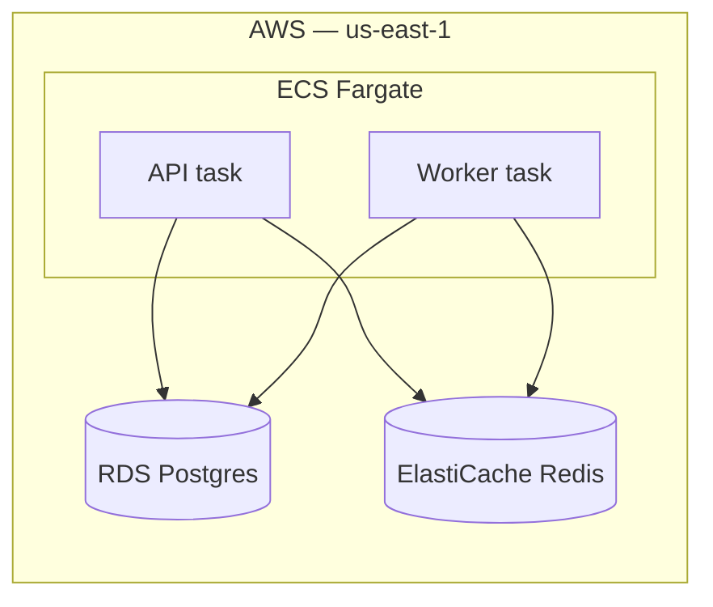
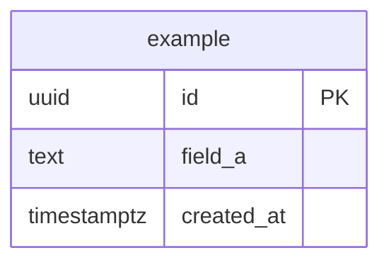

# Design — {Feature Name}

**Feature slug:** `{feature-slug}`
**Status:** Draft
**Date:** {YYYY-MM-DD}
**Standard:** arc42 v8.2 + C4 model
**Supersedes ADRs:** None | ADR-NNNN

---

## 1. Introduction & Goals

What's being built and the measurable outcome it delivers. Quote the relevant user stories from `01-requirements.md` (do not paraphrase — quote, so traceability is exact).

### 1.1 Quality goals (top 3)

| Priority | Quality | Concrete target |
|---|---|---|
| 1 | | |
| 2 | | |
| 3 | | |

### 1.2 Stakeholders

| Role | Expectation from this design |
|---|---|
| Product | |
| Eng lead | |
| Security | |
| SRE / on-call | |

## 2. Constraints

Constraints from `.sevaai-sdlc.yaml -> stack`, `auth`, `compliance`, `release`. Plus:

| Type | Constraint |
|---|---|
| Technical | language, runtime, framework versions we cannot change |
| Organizational | team boundaries, no-deploy windows, ownership |
| Conventions | naming, style, repo conventions |
| Compliance | SOC 2 / GDPR / HIPAA / PCI requirements that bind the design |

## 3. Context & Scope

### 3.1 C4 Level 1 — System Context

The system as a single box. External actors and external systems around it.



> **Lint rules in force:** single-token IDs only (`ExtSystem` not `Ext System`); no `;`/`<`/`>` in messages; no `<tagname>`-style placeholders.

### 3.2 Business context

Who calls this, why, what they expect back.

### 3.3 Technical context

Protocols and data formats at each interface (HTTPS+JSON, gRPC, async events, etc.).

## 4. Solution Strategy

The core approach in 5-10 sentences. Cover:
- Choice of technology and why (defer to existing ADRs where possible)
- The decomposition principle (by domain? by data? by user-facing capability?)
- Quality goals → architectural approaches mapping
- Organizational fit — who owns what

## 5. Building Blocks

### 5.1 C4 Level 2 — Containers

The deployable units. Each container is a process, a database, a cache, a queue, etc.



| Container | Responsibility | Technology | Owns |
|---|---|---|---|
| API | request handling, auth, validation | Fastify 4 / TS / Node 20 | HTTP boundary |
| Worker | async jobs, scheduled tasks | BullMQ on Node 20 | retry/backoff |
| DB | durable state | Postgres 16 | tenant data |
| Cache | hot path, idempotency keys | Redis 7 | ephemeral |

### 5.2 C4 Level 3 — Components (for the most complex container)

Drill into the container that has the most internal complexity. Skip this for trivial designs.



### 5.3 Module / package structure

```
src/services/{feature}/
├── handlers/
├── repository.ts
├── service.ts
├── types.ts
└── validators/
```

## 6. Runtime View

One sequence diagram per critical flow. Aim for 1-3 diagrams; do NOT include every CRUD path.

### 6.1 {Primary flow name}



> **Lint reminder:** no `;` in messages (use `,`); no `<` or `>` (use "above"/"below"/"at least"); no `<code>`-style placeholders (use `[code]`).

## 7. Deployment View

Where each container runs, env-by-env (dev / staging / prod), regional considerations.



| Concern | Dev | Staging | Prod |
|---|---|---|---|
| Region | us-east-1 | us-east-1 | us-east-1 + us-west-2 |
| Replicas | 1 | 2 | 3+ |
| DB tier | db.t4g.micro | db.t4g.small | db.r6g.large |

## 8. Cross-cutting Concepts

### 8.1 Authentication & authorization

Defer to the project's auth ADR. Note any deviations or new scopes/roles.

### 8.2 Persistence

#### Data model

```sql
CREATE TABLE example (
  id          UUID PRIMARY KEY DEFAULT gen_random_uuid(),
  field_a     TEXT NOT NULL,
  created_at  TIMESTAMPTZ NOT NULL DEFAULT now()
);
CREATE INDEX example_field_a_idx ON example (field_a);
```

#### ERD (auto-generate from migrations where possible)



#### Migration plan

Forward order:
1. ...

Rollback order (reverse):
1. ...

### 8.3 API contracts

```yaml
openapi: 3.0.3
info:
  title: {Feature} API
  version: 0.1.0
paths:
  /v1/resource:
    post:
      summary: Create a resource
      security: [{ bearerAuth: [] }]
      requestBody:
        required: true
        content:
          application/json:
            schema:
              type: object
              required: [field_a]
              properties:
                field_a: { type: string, maxLength: 255 }
      responses:
        '201': { description: created }
        '400': { description: validation error }
        '401': { description: unauthorized }
```

### 8.4 Observability

What to emit (logs / metrics / traces / events). Pino redaction rules. Datadog APM tags. Sentry context.

### 8.5 Error handling

Error taxonomy (validation / domain / infra), retry policy, idempotency keys.

### 8.6 Configuration / environment variables

| Variable | Purpose | Default | Source |
|---|---|---|---|
| `{NAME}` | what it controls | none | env / Secrets Manager |

## 9. Architecture Decisions (ADRs)

Each ADR is also written as a standalone file `docs/adr/NNNN-{slug}.md` for grep-ability.

### ADR-NNNN — {Title}

- **Status:** Proposed
- **Context:** What problem demanded a decision?
- **Decision:** What we're doing.
- **Alternatives considered:**
  1. {Alt A} — rejected because {concrete reason that references constraints in §2}
  2. {Alt B} — rejected because {concrete reason}
  3. {Alt C} — rejected because {concrete reason}
- **Consequences:**
  - **Positive:** ...
  - **Negative:** ...
  - **Neutral:** ...
- **Supersedes:** None | ADR-NNNN

## 10. Quality Requirements

Non-functional requirements with measurable targets and verification approach.

| Quality | Target | Verified by |
|---|---|---|
| p99 latency | < 200ms at 100 RPS | k6 load test in stage 4 |
| Availability | 99.9% / 30 days | Datadog SLO |
| Throughput | 1000 events/min/region | k6 load test |
| Security | OWASP ASVS L2 | stage 5 review |

## 11. Risks & Technical Debt

| # | Risk | Likelihood | Impact | Mitigation |
|---|---|---|---|---|
| 1 | | L/M/H | L/M/H | |

Technical debt accepted as part of this design (with a path to repay):

| # | Debt | Why we're taking it on | Repay by |
|---|---|---|---|

## 12. Glossary

| Term | Meaning |
|---|---|
| | |

## 13. First-pass threat model (STRIDE)

| Component | Spoofing | Tampering | Repudiation | Info disclosure | DoS | Elevation |
|---|---|---|---|---|---|---|
| API | | | | | | |
| Worker | | | | | | |
| DB | | | | | | |

The full review and IriusRisk entry happen in stage 5 (`sdlc-security`). This table is the design-stage flag list — anything red here gets escalated.

## 14. Hand-off

Next stage: **Functional-to-Technical Mapping** (`sdlc-mapping`). Artifact: `02b-mapping.md`.

The mapping stage consumes:
- This design doc
- `01-requirements.md`
- The user stories already in Jira / GitHub Issues (if pushed)

It produces a traceability matrix that becomes the input to backlog generation in Stage 3.
