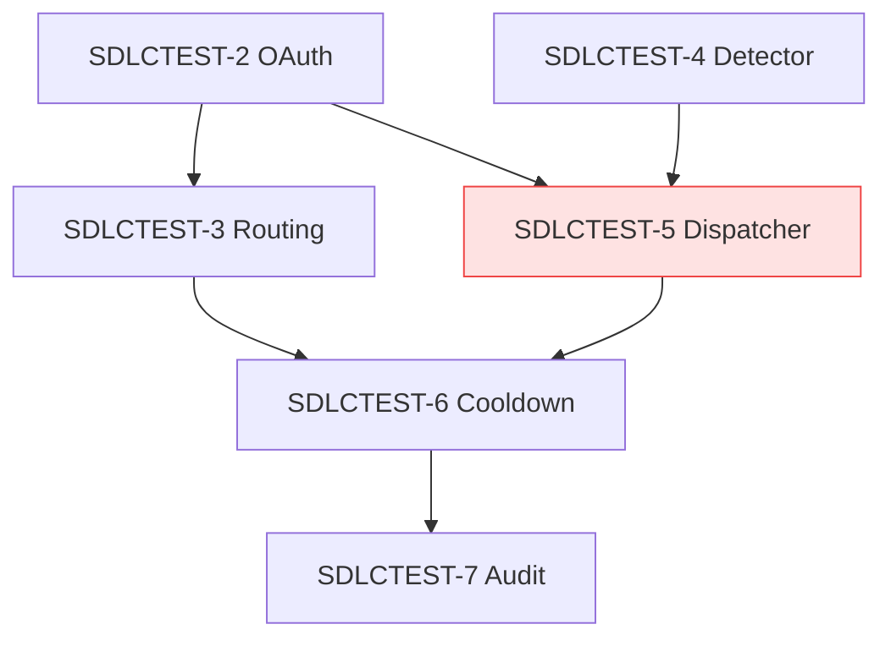

# Functional-to-Technical Mapping — {Feature Name}

**Feature slug:** `{feature-slug}`
**Status:** Draft
**Date:** {YYYY-MM-DD}
**Inputs:** [`01-requirements.md`](./01-requirements.md), [`02-design.md`](./02-design.md)

This artifact is the bridge between the *what* (user stories) and the *how* (code). Each row connects one requirement to the specific files, migrations, and config it requires. Stage 3 (development) consumes this matrix to auto-generate the GitHub Projects v2 backlog.

## 1. Headline counts

| Metric | Value |
|---|---|
| Stories mapped | N |
| Total story points | X |
| NEW files to create | Y |
| EDIT files to modify | Z |
| Migrations | M |
| New env vars | E |
| Risk-H stories (sequence first) | K |
| Cross-cutting / [infra] rows | I |

## 2. Traceability matrix

The load-bearing table. One row per user story. Columns marked `n/a` if genuinely not applicable.

| Req ID | Story | Components touched | Files: NEW | Files: EDIT | Migrations | Config / env vars | Effort | Deps | Risk | Test type | ADR refs |
|---|---|---|---|---|---|---|---|---|---|---|---|
| {SDLCTEST-2} | {Story title — one line} | `{module}` (new) | `{path/to/new1.ts}` | `{path/to/edit1.ts}` | `{timestamp_slug}.up/down.sql` | `FOO_BAR` | M (3 SP) | none | M | unit + integration | ADR-0004 |
| {SDLCTEST-3} | | | | | | | | | | | |
| {SDLCTEST-4} | | | | | | | | | | | |
| {SDLCTEST-5} | | | | | | | | | | | |
| {[infra]} | LaunchDarkly flag `slack-alerts.enabled` | LD config | n/a | n/a | n/a | n/a | S (1 SP) | none | L | smoke | n/a |
| {[infra]} | KMS CMK + IAM policy for Slack tokens | infra | `infra/iam/api.tf`, `infra/kms/slack.tf` | n/a | n/a | `SLACK_KMS_CMK_ID` | M (2 SP) | none | M | integration | ADR-0004 |

### 2.1 Notes on the matrix

- **`Components touched`** uses the building-block names from `02-design.md` §5.
- **`Files: NEW` / `Files: EDIT`** — separated because reviewers think about them differently. NEW gets full review; EDIT gets diff review. The split also drives PR size estimation.
- **`Effort`** uses 1 SP ≈ 1 engineer-day. If size and content disagree (e.g., M sized but 6 NEW files + migration), the mapping skill will have flagged this — see §5.
- **`Deps`** lists Req IDs that must land first.
- **`ADR refs`** — every row should cite the ADR(s) that govern its approach. If a row has no ADR, ask whether the design is missing one.

## 3. Dependency graph

Risky rows highlighted. Long chains are sprint-planning hazards — flag if any chain is >3 stories.

## 4. Cross-cutting / out-of-band work

Items that don't fit cleanly under one user story but are needed for the feature to ship:

| Item | Type | Owner | Effort | When |
|---|---|---|---|---|
| Create LaunchDarkly flag `slack-alerts.enabled` | infra | SRE | 1 SP | before PR 6 |
| Provision KMS CMK + IAM | infra | SRE | 2 SP | before PR 3 |
| Update `docs/runbooks/slack-disconnects.md` | docs | on-call lead | 1 SP | before GA |
| Sales/Support enablement note (one-pager) | comms | PMM | 2 SP | parallel with stage 6 |

These become separate Issues in Stage 3 with `[infra]`, `[docs]`, `[comms]` labels.

## 5. Sizing reconciliation

If any row's `Effort` and content are inconsistent, the mapping skill flagged it. Resolve here before handing off:

| Req ID | Original size | Implied size | Resolution |
|---|---|---|---|
| {SDLCTEST-N} | M | L (8 NEW files + migration) | upsize to L OR split into N.a + N.b |

## 6. Risk register (cross-row)

Risks that emerge from looking at the matrix as a whole, not from any single story:

| # | Risk | Affected rows | Mitigation |
|---|---|---|---|
| 1 | KMS envelope encryption is new for the team | SDLCTEST-2, -5 | spike day before PR 3; pair Eng A with Eng B |
| 2 | Long dependency chain blocks parallelism | -2 → -3 → -6 | sequence in single sprint, single owner |
| 3 | Slack rate-limit handling untested | -5, -6 | dedicated test in stage 4 |

## 7. Hand-off

Next stage: **Development** (`sdlc-development`). Artifact: `03-development.md`.

Stage 3 will:
1. Read this matrix.
2. Create one GitHub Issue per row (story + cross-cutting).
3. Apply labels (`story`, `infra`, `docs`, `comms`, plus risk + ADR labels).
4. Link dependencies (`Blocked by #N`).
5. Add all Issues to the GitHub Projects v2 board configured in `.sevaai-sdlc.yaml -> trackers.github.project_v2_number`.
6. Write `03-development.md` with the PR plan grouped by sprint-able batch.

The matrix is the source of truth. If a row changes (effort, files, deps), update this artifact first, then re-run development if the GitHub Issues need to follow.
